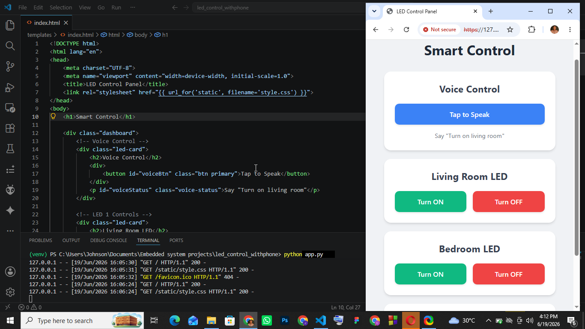

# Smart LED Control System

A simple, professional, and interactive web application to control LEDs connected to an Arduino. This project allows you to control your lights using a web interface from any device (like your smartphone) on the same Wi-Fi network, and it even includes **Voice Control**!

## Features

*   ** Mobile-Friendly Web Interface**: A responsive and modern dashboard to control your LEDs.
*   ** Voice Control**: Use your browser's built-in speech recognition to turn lights on or off by just speaking (e.g., "Turn on living room").
*   ** Local Network Access**: Control your Arduino from your smartphone or tablet without needing internet access.
*   ** Real-Time Control**: Instantaneous feedback between the web app and the Arduino.

## Prerequisites

### Hardware Requirements
*   1x Arduino board (e.g., Arduino Uno)
*   3x LEDs (for Living Room, Bedroom, and Kitchen)
*   3x Resistors (e.g., 220Ω or 330Ω)
*   Breadboard and jumper wires
*   USB cable to connect the Arduino to your computer

### Software Requirements
*   **Python 3.x** installed on your computer.
*   **Flask**: A lightweight Python web framework.
*   **pyserial**: A Python library to communicate with the Arduino.

## Setup Instructions

### 1. Arduino Setup
1.  Connect your LEDs to the Arduino pins.
2.  Write and upload a simple Arduino sketch that listens to the Serial port (`9600` baud rate) for specific characters to turn LEDs on or off:
    *   `A` / `a`: Turn LED 1 (Living Room) ON / OFF
    *   `B` / `b`: Turn LED 2 (Bedroom) ON / OFF
    *   `C` / `c`: Turn LED 3 (Kitchen) ON / OFF
3.  Take note of the COM port your Arduino is connected to (e.g., `COM3`).

### 2. Software Setup
1.  Clone or download this project to your computer.
2.  Open a terminal or command prompt in the project folder.
3.  Install the required Python libraries using pip:
    ```bash
    pip install Flask pyserial
    ```
4.  Open `app.py` and ensure the `COM3` port matches your Arduino's port. If it's different, update the following line:
    ```python
    arduino = serial.Serial('COM3', 9600)
    ```

## How to Run

1.  Start the Flask server by running the following command in your terminal:
    ```bash
    python app.py
    ```
2.  The application will start running on your local network. You should see an output in the terminal showing your local IP address (e.g., `Running on https://192.168.x.x:5000/`).
3.  **On your computer:** Open a web browser and go to `https://127.0.0.1:5000` or `https://localhost:5000`. *(Note: Your browser might warn you about the SSL certificate being unsafe because it is self-signed adhoc certificate. You can safely proceed/bypass the warning. HTTPS is required for the browser to allow microphone access).*
4.  **On your phone:** Ensure your phone is connected to the same Wi-Fi network as your computer. Open a web browser on your phone and enter your computer's IP address with port 5000 (e.g., `https://192.168.1.50:5000`).

## Voice Commands
Tap the **"Tap to Speak"** button on the dashboard and try saying:
*   *"Turn on living room"*
*   *"Turn off living room"*
*   *"Turn on bedroom"*
*   *"Turn off bedroom"*
*   *"Turn on kitchen"*
*   *"Turn off kitchen"*

## Project Structure

*   `app.py`: The main Python server file using Flask to handle web requests and serial communication.
*   `templates/index.html`: The HTML file for the web dashboard.
*   `static/style.css`: The CSS file that styles the web dashboard.

---
*Built with Flask, Python, and Arduino.*